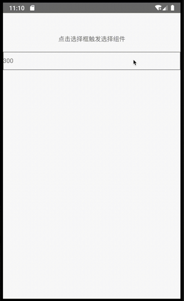

# react-native-wheel

## Getting started

**yarn**: `$ yarn add react-native-wheel`

**npm**: `$ npm install react-native-wheel --save`

### Mostly automatic installation

`$ react-native link react-native-wheel`

### Manual installation

#### Android

1. Open up `android/app/src/main/java/[...]/MainActivity.java`
  - Add `import com.reactlibrary.RNWheelPackage;` to the imports at the top of the file
  - Add `new RNWheelPackage()` to the list returned by the `getPackages()` method
2. Append the following lines to `android/settings.gradle`:
  	```
    	include ':react-native-wheel'
    	project(':react-native-wheel').projectDir = new File(rootProject.projectDir, 	'../node_modules/react-native-wheel/android')
   ```
3. Insert the following lines inside the dependencies block in `android/app/build.gradle`:
    ```
      implementation project(':react-native-wheel')
    ```

## Usage

### Base usage
```
import { WheelPanel } from 'react-native-wheel';

...
<WheelPanel
  style={...}
  title='title'
  options={...}
  value={...}
  onValueChange={...}
/>
...
```
[Base usage](./example/panel.tsx)
[multi options usage](./example/panel-multi.tsx)

 

### original wheel usage
[original wheel usage](./example/view.tsx)

 

